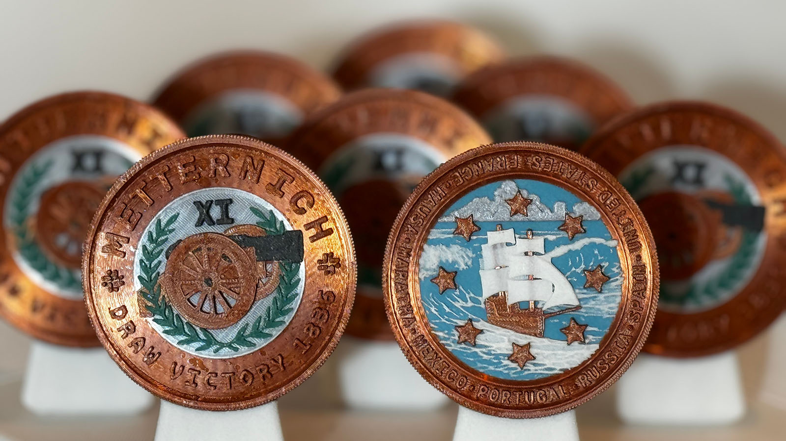

# Metternich XI (M11)

## Draw Victory 1836

### Issued to

Russia - Andrew Goldston

### Design

Graham Lampa

### Certification

Manoli Strecker

### Also issued to

* France - Marc Tracy
* Hausa - Jordan Fraade
* Marataha - Chas Carey
* Mexico - Thomas Haver
* Portugal - Noah Mamis
* Spain - Chris Hooks
* United States - Brendan O'Connor

## Details

### Serial number

MCC203259

### Manufactured
January 7, 2024

### Description

Bronze, color, reeded edge
