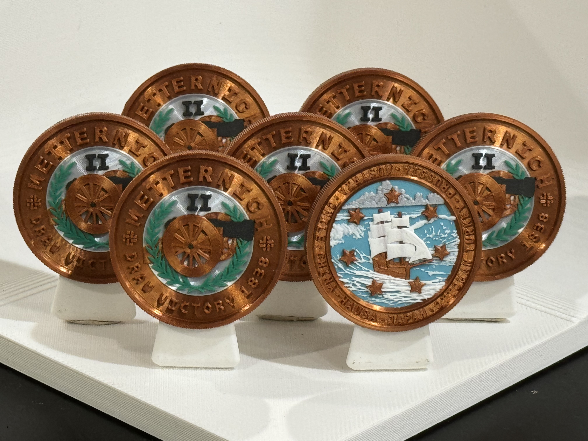

# Metternich II (M2)

## Draw Victory 1838

### Issued to

Japan - Chris Hooks

### Design

Graham Lampa

### Certification

Manoli Strecker

### Also issued to

* Austria - Emily Tamkin
* Chile - Marshall Steinbaum
* China - Ben Guarino
* Hausa - Evan Hill
* Ottoman Turkey - Neel Patel
* Prussia - Carol Schaeffer

## Details

### Serial number

MCC189478437

### Manufactured
January 30, 2024

### Description

Bronze, color, reeded edge
