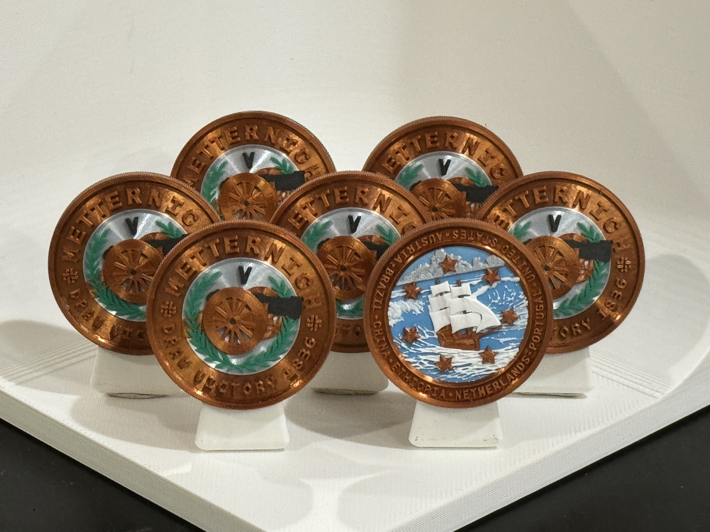

# Metternich V (M5)

## Draw Victory 1836

### Issued to

Ethiopia - Mark Egerman

### Design

Graham Lampa

### Certification

Manoli Strecker

### Also issued to

* Austria - George Pearkes
* Brazil - Evan Hill
* China - Frank Matt
* Netherlands - Alex Yablon
* Portugal - Emily Tamkin
* United States - Chris Hooks

## Details

### Serial number

MCC283708200

### Manufactured
January 30, 2024

### Description

Bronze, color, reeded edge
