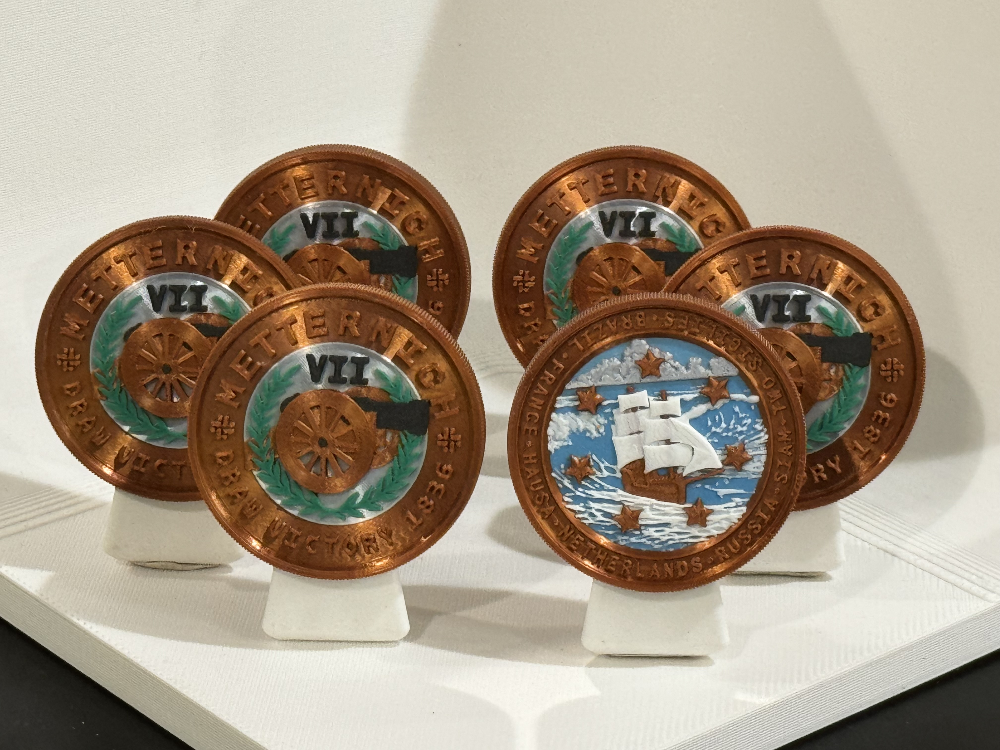

# Metternich VII (M7)

## Draw Victory 1836

### Issued to

Two Sicilies - Emily Tamkin

### Design

Graham Lampa

### Certification

Manoli Strecker

### Also issued to

* Brazil - Neel Patel
* France - Frank Matt
* Hausa - David Klion
* Netherlands - Chris Hooks
* Russia - Evan Hill
* Siam - Max Fisher

## Details

### Serial number

MCC902029265

### Manufactured
February 28, 2024

### Description

Bronze, color, reeded edge
