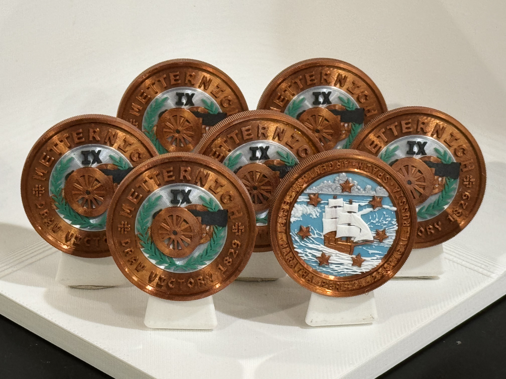

# Metternich IX (M9)

## Draw Victory 1829

### Issued to

Egypt - Eoin Higgins

### Design

Graham Lampa

### Certification

Manoli Strecker

### Also issued to

* Argentina - James Grebey
* Maratha - Emily Tamkin
* Persia - Evan Hill
* Portugal - David Klion
* Russia - Jack Crosbie
* Spain - Max Cohen

## Details

### Serial number

MCC698645257

### Manufactured
February 28, 2024

### Description

Bronze, color, reeded edge
